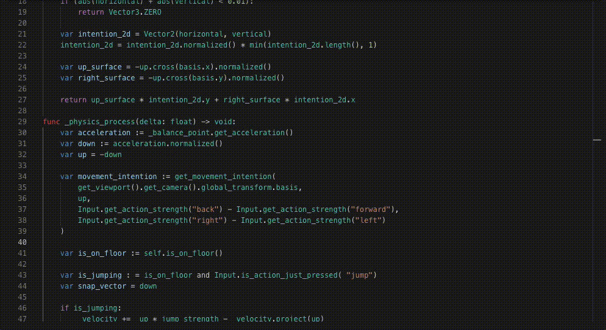

# Git Diff Stepper

An app that allows you to animate through the `git log` iterations of a file.

It is technically a continuation of [VSCode Git Diff Stepper](https://github.com/Ivorforce/VSCode-Git-Diff-Stepper): VSCode doesn't expose a way to create editors in insets, and that [won't change in the near future](https://github.com/microsoft/vscode/issues/153198). Other projects embed instances of Monaco and try to fit the style; at this point I decided I might as well create a standalone app which may make animations easier too.

## Controls

- Select a file using File -> Open. The file must be tracked by git, and should have multiple commits.
- `cmd / ctrl` + `alt / option` + `left` or `right` arrow keys move through iterations.
- `f1` to launch the command palette.

## Custom Language Support

We have support for textmate `.tmLanguage` files!

- Drop a `.tmLanguage` file into `$AppData/de.ivorius.gitdiffstepper/tmlanguages`.
- The file name should be equivalent to the file ending (e.g. `css.tmLanguage` for `.css` files).
- Relaunch the App.

To switch the language manually, use the command palette.

## Custom Theme Support

We have support for vscode themes! 
- In VSCode, run the command "Developer: Generate Color Theme From Current Settings".
- Convert the resulting `.jsonc` file to regular `.json` (removing comments and trailing commas).
- Drop the file into `$AppData/de.ivorius.gitdiffstepper/themes`.
- Relaunch the App.

To switch the theme, use the command palette.

## Dev Setup

- Install Rust, pnpm
- `pnpm install`
- `pnpm tauri dev`

### Tech Stack

- [Tauri](https://tauri.app) as a web app host.
- [React](https://react.dev) as a frontend library.
- [Monaco](https://microsoft.github.io/monaco-editor/) as a code editor.
